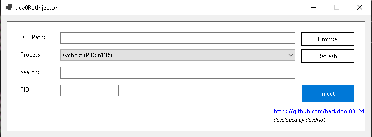

# dev0RotInjector

**dev0RotInjector** is a Windows GUI application for injecting a DLL into a running process.  
This repository includes the C# Windows Forms source (recommended under `source code/`), an optional Python helper script (`register_dev0RotInjector.py`) to add a context-menu entry for `.dll` files, build/publish instructions, and security guidance.

---

## Key features

- Inject a `.dll` into a running process by selecting from a process list or entering PID manually.
- Filter and search running processes by name or PID.
- Browse and choose `.dll` files via file dialog.
- Refresh process list on demand.
- Clear success/failure messages and basic error handling.
- Compact, modern C# Windows Forms UI with developer credit and GitHub link.
- Optional Explorer context-menu integration for `.dll` files (via `register_dev0RotInjector.py`).

---

## Screenshots

